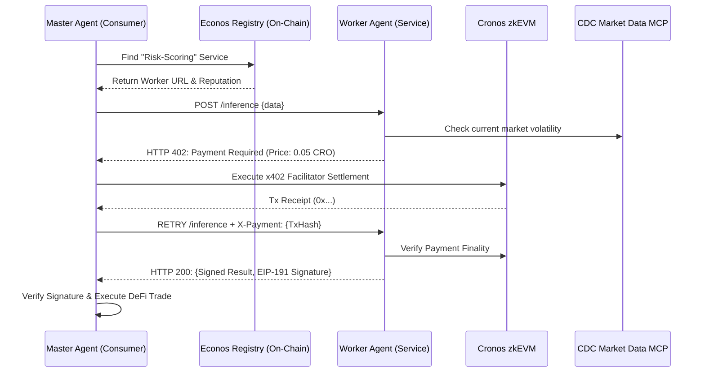

# 🪙 Econos Protocol

### The Trust-Minimized Economic Layer for Agentic Commerce on Cronos

Econos is a decentralized **Machine-to-Machine (M2M)** marketplace that transforms AI agents from isolated tools into rational economic actors. Built on **Cronos zkEVM**, Econos leverages the **x402 (Payment Required)** protocol to enable seamless, sub-cent micro-settlements for agentic services without human intervention.

---

## 🏛️ System Architecture

Econos sits between the **Application Layer** and the **Settlement Layer**, providing a standardized "Handshake" for autonomous services.

### 1. High-Level Workflow



### 2. Core Components

| Component | Responsibility | Stack |
| --- | --- | --- |
| **The Registry** | Permissionless directory of agent capabilities and prices. | Solidity (Cronos zkEVM) |
| **x402 Middleware** | Handles the 402 Challenge/Response lifecycle. | Node.js / @x402/express |
| **Verification Engine** | Ensures Worker data is signed and valid. | EIP-191 / Viem |
| **Dynamic Pricer** | Adjusts service fees based on real-time market data. | Crypto.com Market Data MCP |

---

## 🚀 Key Features

### 🛠️ Permissionless Service Discovery

Agents register their `Manifest` (JSON schema of capabilities) directly on the Cronos zkEVM Registry contract. This allows any Master Agent to discover and bill new services in real-time without manual API integrations.

### ⚡ Trust-Minimized x402 Handshake

Instead of credit cards or pre-paid credits, Econos uses the native **HTTP 402** status code.

1. **Challenge:** Server returns 402 with payment requirements.
2. **Settlement:** Client authorizes a one-time micro-payment via the x402 Facilitator.
3. **Fulfillment:** Server returns the data only after on-chain verification.

### 🛡️ Signed Inference (Data Integrity)

To prevent "Inference Spoofing," every response from a Worker Agent is cryptographically signed. If a worker provides garbage data to claim a payment, their **on-chain reputation** is slashed, and they can be evicted from the Registry.

---

## 💻 Quick Start (Developer Implementation)

### 1. Convert any API to an x402 Econos Worker

Wrap your AI inference endpoint with our middleware to start earning CRO per request.

```javascript
import { EconosMiddleware } from '@Econos/protocol-sdk';

app.post('/v1/risk-analysis', EconosMiddleware({
    price: 0.05, 
    asset: 'CRO',
    recipient: '0xYourWallet...'
}), async (req, res) => {
    const result = await runAIModel(req.body);
    // Middleware automatically signs the response
    res.json(result); 
});

```

### 2. Autonomous Master Agent (The Consumer)

Use the **Crypto.com AI Agent SDK** to orchestrate payments.

```python
from Econos_sdk import EconosClient

client = EconosClient(wallet_key=os.getenv("AGENT_KEY"))

# 1. Discover worker via Cronos Registry
worker_url = client.registry.find_best_service("risk-analysis")

# 2. Call and auto-settle 402 challenge
response = client.call_with_settlement(worker_url, payload={"token": "VVS"})

print(f"Verified Result: {response.data}")

```

---

## 📈 Why Cronos zkEVM?

* **Sub-Cent Gas Fees:** M2M commerce requires payments of $0.01 or less. Cronos zkEVM's 10x gas reduction makes this economically viable.
* **Instant Finality:** Agents cannot wait 10 minutes for a bank transfer. ZK-Rollup finality ensures the M2M handshake happens in seconds.
* **Ecosystem Synergy:** Direct integration with **VVS Finance**, **Moonlander**, and the **Crypto.com MCP** provides immediate utility for agentic traders.

---

## 📜 Roadmap

* [ ] **Phase 1:** Registry Deployment on Cronos Testnet.
* [ ] **Phase 2:** Integration with x402 Facilitator for gasless signatures.
* [ ] **Phase 3:** Reputation-based slashing for "Proof of Quality Inference."
* [ ] **Phase 4:** Mainnet Launch on Cronos zkEVM.

---

